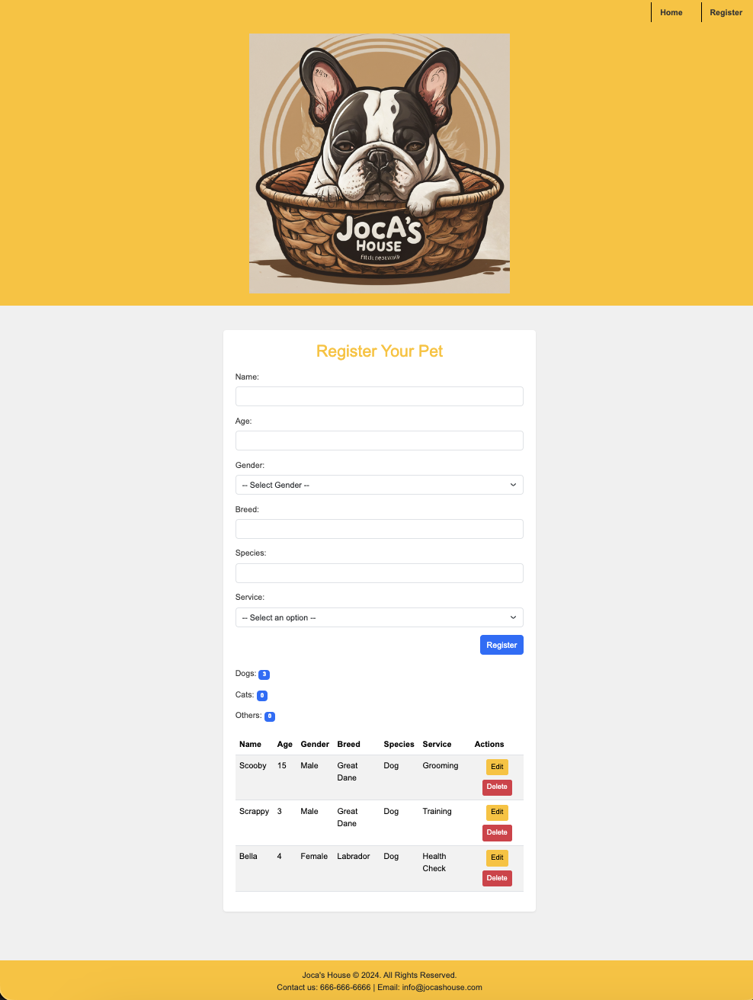

# Joca's House


Joca's House is a web application that allows users to register their pets for grooming, training, and health check services. Users can view the list of registered pets, edit their details, and delete entries. The application also displays the total number of registered pets and the latest registered pet.

## Table of Contents

- [Features](#features)
- [Technologies Used](#technologies-used)
- [Setup Instructions](#setup-instructions)
- [Usage](#usage)
- [License](#license)
- [Contact](#contact)

## Features

- Register pets with details like name, age, gender, breed, species, and service.
- Display the list of registered pets in a table format.
- Edit and delete pet entries.
- Show the total number of registered pets.
- Display details of the latest registered pet.

## Technologies Used

- HTML
- CSS (Bootstrap for styling)
- JavaScript


## Setup Instructions

1. **Clone the repository:**

    ```bash
    git clone <repository-url>
    ```

2. **Navigate to the project directory:**

    ```bash
    cd jocashouse
    ```

3. **Open `index.html` and `register.html` in a browser:**

    - Open `index.html` to view the homepage.
    - Open `register.html` to register pets.

## Usage

### Homepage

The homepage displays a welcome message, the total number of registered pets, and details of the latest registered pet.


### Registration Page

The registration page allows users to register their pets. It displays a form to enter pet details and a table of registered pets with options to edit and delete entries.




## License

This project is licensed under the MIT License. See the [LICENSE](LICENSE) file for details.

## Contact

- Name: Brandon Bennington
- Email: [brandonwbennington@gmail.com](mailto:brandonwbennington@gmail.com)
- GitHub: [My GitHub Profile](https://github.com/bwbennington)

